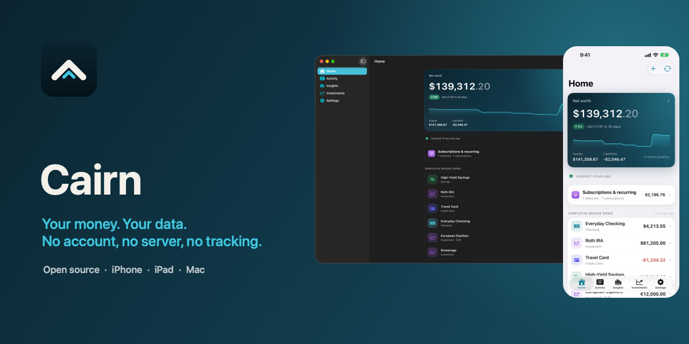
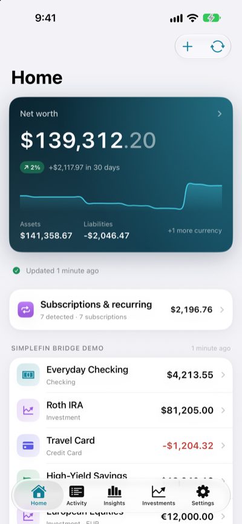
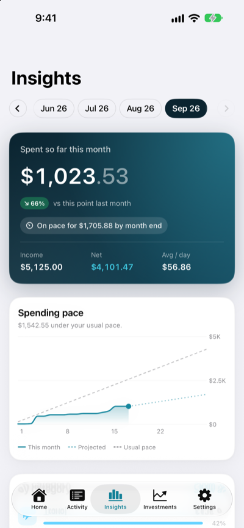
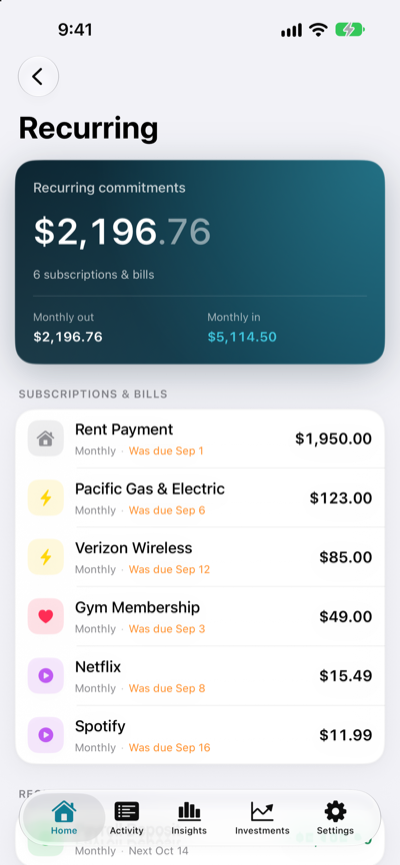
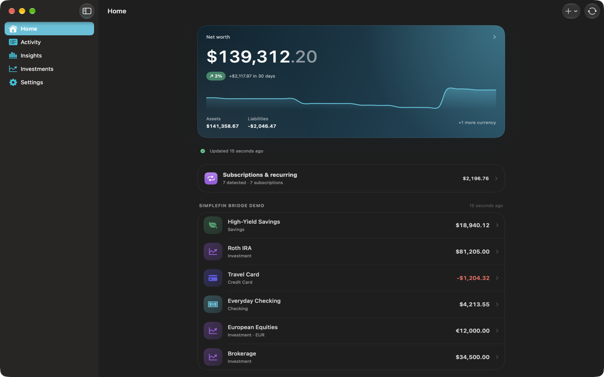

[](https://github.com/sehejjain/cairn/actions/workflows/ci.yml)
[](https://github.com/sehejjain/cairn/releases/latest)
[](LICENSE)
[](#requirements)
[](#build)
[](TESTFLIGHT_PUBLIC_LINK)

Cairn is a privacy-first personal finance app for iPhone, iPad, and Mac, for
people who want to see their whole financial picture without handing it to a
company. It reads the bank accounts you authorize through
[SimpleFIN](https://www.simplefin.org) and Apple Wallet, enriches everything on
your device, and — if you choose — syncs between your devices through your own
private iCloud database. There is no Cairn backend. Ever.

## Screenshots

<p align="center">
  
  
  
</p>

<p align="center">
  
</p>

## Project status

Cairn is in **public beta on TestFlight**, heading toward **1.0 on the App
Store**. It is usable today for read-only tracking of real accounts; there are
no budgets, reports, or exchange rates yet.

## Try it

- Join the beta: **[TESTFLIGHT_PUBLIC_LINK]**
- Bank sync needs a [SimpleFIN Bridge](https://www.simplefin.org) account, which
  is a separate paid service. Cairn talks to it directly; there is no Cairn
  server in between.
- You can use Cairn without SimpleFIN: add manual accounts and import CSV
  exports from your bank or another app.
- Apple Wallet import (Apple Card, Apple Cash, Savings) works on iPhone and
  iPad. On the Mac, Wallet accounts appear through **iCloud Sync**.
- **This is a beta.** Bank transactions can always be downloaded again from
  SimpleFIN, and a saved connection can be reconnected without a new setup
  token. But notes, tags, categories, rules, manual accounts, and CSV imports
  live only in Cairn — turn on iCloud Sync, or export from **Settings → Your
  data**, if you rely on them.
- Requires iOS 26, iPadOS 26, or macOS 26.

## What it does

- Connects to SimpleFIN Bridge or a bank-hosted SimpleFIN server, and reads
  Apple Wallet financial data through FinanceKit on iPhone and iPad.
- Shows accounts, balances, transactions, and net worth per currency.
- Categorizes on-device: rules you write yourself, merchant memory, and — where
  available — Apple Intelligence. Notes, tags, and manual categories are never
  overwritten by automation.
- Manages those rules and free-form tags in Settings, and can start a rule from
  any transaction's detail screen.
- Finds subscriptions and other regular payments entirely on-device, with the
  expected next charge.
- Investments and holdings, with cost basis and gain per position.
- Insights: spending pace, category breakdowns, and six-month trends.
- Imports CSV exports from other apps, and adds manual accounts.
- Syncs across devices through your private iCloud database with **end-to-end
  encrypted financial fields** — Apple stores the record, not the amount. iCloud
  sync is opt-in; new installs keep everything on this device.
- Optional Face ID / Touch ID app lock.
- Exports every transaction to CSV or JSON, and can delete everything.

## Privacy

- **No server, no analytics, no third-party SDKs.** The only network traffic is
  to the SimpleFIN server you configure, plus your own iCloud database if you
  turn sync on. Nothing is sent to us. If a bank reports a custom currency
  (miles, points), Cairn fetches that descriptor once from the HTTPS URL the
  SimpleFIN response names, and caches it.
- Apple Wallet data is read through FinanceKit on-device and mirrored into the
  same store as everything else, so it follows the same storage choice.
- Categorization runs on-device. When Apple Intelligence is used, transaction
  text is handled by the system model locally and never sent to a server.
- The SimpleFIN Access URL is a bearer credential and lives in the **Keychain**,
  never in the database or logs.
- Every field that reveals financial detail is marked
  `@Attribute(.allowsCloudEncryption)`: balance and amount minor units, account
  and holding values, transaction descriptions, dates and normalized merchant
  names, notes, institution/account/category/tag names, currency codes and
  custom-currency labels, account type, and rule names, patterns, and amount
  bounds. CloudKit encrypts those fields end-to-end, independent of Advanced
  Data Protection.
- Financial amounts are stored as integer minor units — exact, and never a float.

See [`docs/threat-model.md`](docs/threat-model.md) and
[`docs/privacy-policy.md`](docs/privacy-policy.md).

## Requirements

- Xcode 27 or newer
- iOS 26 / iPadOS 26 / macOS 26 deployment target
- [XcodeGen](https://github.com/yonaskolb/XcodeGen) (`brew install xcodegen`)

## Build

```sh
# Generate the Xcode project from project.yml
xcodegen generate

# Run the core test suite
swift test

# Build the app (macOS)
xcodebuild -project Cairn.xcodeproj -scheme Cairn -destination 'platform=macOS' build

# Build the app (iOS simulator)
xcodebuild -project Cairn.xcodeproj -scheme Cairn \
  -destination 'platform=iOS Simulator,name=iPhone 17 Pro' build
```

The Xcode project is generated and not checked in. Edit `project.yml`, not the
`.xcodeproj`.

### Signing (device builds and iCloud)

The simulator needs no signing setup. To build for a device or enable iCloud
sync, put your own team and bundle identifier in a git-ignored local file:

```sh
cp Config/Signing.example.xcconfig Config/Signing.local.xcconfig
# edit DEVELOPMENT_TEAM and PRODUCT_BUNDLE_IDENTIFIER, then:
xcodegen generate
```

`Config/Signing.xcconfig` holds safe defaults and pulls in that local file via
`#include?`. `ICLOUD_CONTAINER_ID` names the CloudKit container and defaults to
`iCloud.<bundle id>`, so no shared container is baked into the repo. Every
configuration ships the same entitlements, so CloudKit and iCloud Keychain work
in Debug as well as Release; whether iCloud is used is decided at runtime
(`ubiquityIdentityToken`), with local-only fallback when there is no account.
See [`docs/releasing.md`](docs/releasing.md) for the details.

### Running without a SimpleFIN token

Debug builds accept `--cairn-sample-data`, which loads demo accounts and
transactions so you can explore the UI:

```sh
xcodebuild ... -scheme Cairn build
xcrun simctl launch <device> <your.bundle.id> --cairn-sample-data
```

## Architecture

CairnCore is a local Swift package holding all logic — models, the SimpleFIN
client, the sync engine, security, enrichment, and export — so it can be tested
without a simulator. The app target is a thin SwiftUI layer.

See [`docs/architecture.md`](docs/architecture.md) for the full picture.

## Releasing

Releases are cut from `main` by pushing a `vX.Y.Z` tag. CI runs the tests,
uploads iOS and macOS builds to TestFlight, and publishes a GitHub Release with
generated notes and dSYMs:

```sh
Scripts/release.sh patch    # or minor / major
```

See [`docs/releasing.md`](docs/releasing.md) for the versioning scheme, the
required repository secrets, the CloudKit schema-promotion step, and the hotfix
flow.

## Contributing

Contributions are welcome — please read [`CONTRIBUTING.md`](CONTRIBUTING.md) and
the [`CODE_OF_CONDUCT.md`](CODE_OF_CONDUCT.md). Security issues: see
[`SECURITY.md`](SECURITY.md).

## License

Apache-2.0. See [`LICENSE`](LICENSE) and [`NOTICE`](NOTICE).

Cairn is not affiliated with SimpleFIN or any financial institution.
